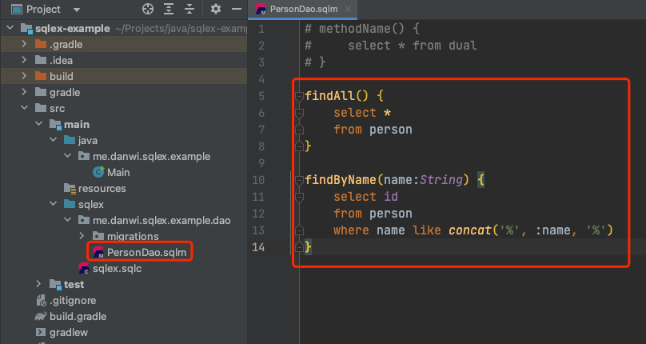

# 快速开始

### SqlEx 是什么

SqlEx (SQL extension) 是一个简单的 DB helper.  
从实际应用角度出发, 解决编程语言(Java)和关系型数据库之间对于类型和结构认知不匹配的问题.  
主要思路是通过对数据库结构和 SQL 做语义分析, 依据分析得出的结果, 生成对应的类型. 提供`强类型安全`的编程体验.  
将大部分错误从`运行时`前推到`编译时`/从`编译时`前推到`编辑时`, 保证错误写法有提示, 错误写法无法编译通过, 能编译通过进运行环境的程序不会出现数据库结构/类型错误.

### 支持范围

- JDK >= 1.8
- Gradle >= 6
- Maven >= 3
- IDEA 版本 >= 2021.1
- 目前数据库只支持 MySQL

### IDEA 插件安装

SqlEx 的编辑体验**严重**依赖于 IDEA 插件, 插件提供了诸如 `智能提示`,`错误感知` 等功能.  
插件可以在 **IDEA 内置插件管理器** 或者 [官方插件市场](https://plugins.jetbrains.com/plugin/19025-sqlex) 下载安装.

**!!强烈建议先安装 IDEA 插件!!**

### 构建系统配置

SqlEx 的编译任务依赖于构建系统, 目前支持 Gradle 和 Maven.  
当前中央仓库最新版本
[](https://search.maven.org/search?q=me.danwi.sqlex)  
使用 IDEA 新建项目后, 可以在构建配置中引入 SqlEx 相关的插件和依赖.

#### Gradle

```groovy
plugin {
    id 'me.danwi.sqlex' version '{{最新版本号}}'
}

dependencies {
    implatetions 'me.danwi.sqlex:core' //这里无须填写版本号,会由插件来自动配置
    implementation 'mysql:mysql-connector-java:8.0.29'
}
```

#### Maven

```xml
<dependencies>
    <dependency>
        <groupId>me.danwi.sqlex</groupId>
        <artifactId>core</artifactId>
        <version{{最新版本号}}</version>
    </dependency>
    <dependency>
        <groupId>mysql</groupId>
        <artifactId>mysql-connector-java</artifactId>
        <version>8.0.29</version>
    </dependency>
</dependencies>
<build>
    <plugins>
        <plugin>
            <groupId>me.danwi.sqlex</groupId>
            <artifactId>sqlex-maven-plugin</artifactId>
            <version>{{最新版本号}}</version>
            <executions>
                <execution>
                    <goals>
                        <goal>generate</goal>
                    </goals>
                </execution>
            </executions>
        </plugin>
    </plugins>
</build>
```

### 创建 SqlEx Repository

**Repository** 是 SqlEx 中的一个重要概念.  
从感性角度来理解, 可以认为一个 Repository 对应着一个数据库.  
其包含了 **编译配置** / **数据库结构的描述** / **针对数据的 CRUD 方法定义** 等, Repository 拥有自己的 ID, 以 java 包的方式描述, 称之为 **根包名**.

以 gradle 工程为例:

1. 在 src/main 下新建名为 sqlex 的文件夹, 然后在 sqlex 夹下建立 sqlex.sqlc 配置文件.  
   
2. 文件夹和配置文件建立后, 修改 sqlex.sqlc 配置文件, 修改根包名, 我们这里修改为`me.danwi.sqlex.example.dao`, 然后点击右上角的 + 图标, 将其导入编辑器解析.  
   
3. 如果配置文件没有错误, 编辑器成功导入. 那么 Repository 文件夹将会被标记为源码文件夹(蓝色), 同时 **SqlEx Repository 工具窗** 将出现你导入的 Repository 信息.  
     
   至此, Repository 已经创建完毕.

### 设计数据库结构

Repository 建立完毕后, 可以针对该 Repository 做 Schema 描述.  
Schema 信息以迁移脚本的方式表达, 兼顾 **数据库版本迁移** 和 **结构描述** 功能, 文件拓展名为 `sqls`.

1. 在根包目录下创建子目录用于存放 Schema 信息, 我们这里是 `me.danwi.sqlex.example.dao.migrations`, 创建数据库版本 0 的迁移脚本.  
   文件名: `000-person-table.sqls`.  
   全路径: `src/main/sqlex/me/danwi/sqlex/example/dao/migrations/000-person-table.sqls`

```sql
create table person(
    id integer auto_increment primary key,
    name varchar(255) not null
);
```

2. 文件建立完成后, 可以点击右上角的 "同步" 按钮来更新索引信息.  
   

3. 同步完成后, **Database 工具窗** 将出现对应的数据库信息.  
     
   自此, 数据库结构的描述初步完成.

### 编写数据访问方法

数据访问方法, 使用自定义的语言(`SqlEx Method`)编写, 文件拓展名为 `sqlm`;

我们建立一个针对`Person`业务的数据访问方法文件, `PersonDao.sqlm`, 目录为 `me/danwi/sqlex/example/dao/PersonDao.sqlm`

```
findAll() {
    select *
    from person
}
```

  
很容易理解, 方法名称叫 `findAll`, SQL 为 `select * from perosn`, 该方法的作用就是查询出 `person` 表中所有的行.

### 在 Java 中使用 DAO 方法

经过上面的步骤, SqlEx 部分的代码已经全部完成. 现在我们编写 MainClass, 来调用 SqlEx 写的方法, 做数据库访问.

```java
package me.danwi.sqlex.example;

import me.danwi.sqlex.core.DaoFactory;
import me.danwi.sqlex.example.dao.PersonDao;
import me.danwi.sqlex.example.dao.Repository;

import java.util.List;

public class Main {
    public static void main(String[] args) {
        //新建dao factory
        DaoFactory factory = new DaoFactory(
                "jdbc:mysql://localhost:3306/sqlex",
                "root", "password",
                Repository.class //自动生成的Repository类
        );
        //迁移数据库版本
        factory.migrate();
        //检查数据库结构的一致性
        factory.check();

        //获取Dao
        PersonDao personDao = factory.getInstance(PersonDao.class); //自动生成的PersonDao类

        //查询数据
        List<PersonDao.FindAllResult> results = personDao.findAll(); //自动生成的FindAllResult结果类
        if (!results.isEmpty()) {
            System.out.println(results.get(0).getName());
        }
    }
}
```

如上代码, 其中 `me.danwi.sqlex.example.dao.Repository` 类型代表了该 Repository, 其上有 Repository 的元信息. 使用该类型作为参数创建一个 `DaoFactory`. 可以使用该工厂去实例化数据访问对象. 我们这里创建了一个 `PersonDao` 的实例, 然后调用我们自己编写的 `findAll` 方法, 获取到一个 `PersonDao.FindAllResult` 的列表, 这个列表就是查询结果.

上述的 `Repository`/`PersonDao`/`PersonDao.FindAllResult` 都由框架自动生成, 其中 `FindAllResult` 类的属性, 通过结合数据库结构定义, 然后分析 SQL 语句得出.

### 总结

通过上面一个 "无用且蛋疼" 的例子, 简单介绍了 SqlEx 的设计.

你可以根据自己实际的项目需求, 创建多个迁移脚本(如 001-add-age-to-person.sqls), 或者创建一个复杂的 `join`/`groupby` 查询. 体验一下 SqlEx 框架自动(`分析`/`生成`/`强类型安全`)的魅力.

也可以访问 [Gradle Example](https://github.com/sqlex/gradle-example), [Maven Example](https://github.com/sqlex/maven-example) 学习 SqlEx 的基本用法. 另外框架也对 SpringBoot 做了集成, 可以访问 [Spring Example](https://github.com/sqlex/spring-example) 了解具体集成的方法.
